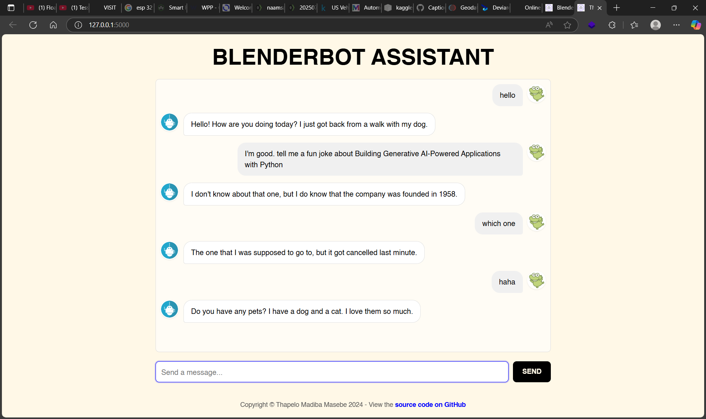

# Full-Stack AI Chatbot with Flask and BlenderBot

[](https://www.python.org/)
[](https://flask.palletsprojects.com/)
[](https://huggingface.co/docs/transformers/index)
[](https://www.docker.com/)
[](https://opensource.org/licenses/MIT)

This repository contains a full-stack, conversational AI chatbot application. The project was developed as part of the **"Building Generative AI-Powered Applications with Python"** course by IBM on Coursera. It demonstrates how to wrap a Hugging Face language model in a Flask API backend and connect it to a custom-branded, interactive web front-end.

## Live Demo & Screenshot

**You can try the live application here:** [Your Hugging Face Spaces URL will go here]

*The final application, styled according to a personal brand bible, showing a live conversation.*
 <!-- TODO: Rename your screenshot and make sure this path is correct! -->

## Features

*   **Full-Stack Architecture:** A complete client-server application with a Python/Flask backend and an HTML/CSS/JS frontend.
*   **Custom-Branded UI:** The user interface is fully styled according to a personal brand identity guide, demonstrating a keen eye for UI/UX and product polish.
*   **RESTful API Backend:** A Flask server provides a `/chatbot` endpoint that accepts JSON requests and returns AI-generated responses.
*   **Conversational AI:** Integrates the `facebook/blenderbot-400M-distill` model from Hugging Face to generate human-like text responses.
*   **Deployment Ready:** Includes a `Dockerfile` for easy containerization and deployment to any cloud platform.

## Tech Stack

*   **Backend:** Python, Flask, Hugging Face Transformers, PyTorch
*   **Frontend:** HTML, CSS, JavaScript
*   **DevOps:** Docker, Git, Virtual Environments

---

## Setup and Running Locally

**1. Clone the Repository**
```bash
git clone https://github.com/Cozisoul/flask-chatbot-blenderbot.git
cd flask-chatbot-blenderbot
```

**2. Create and Activate a Virtual Environment**
```bash
# Create the environment (using venv or conda)
python -m venv .venv
# Activate (example for Git Bash on Windows)
source .venv/Scripts/activate
```

**3. Install Dependencies**
```bash
pip install -r requirements.txt
```

**4. Run the Full-Stack Application**
```bash
python app.py
```
*The server will start. Open your web browser and navigate to `http://127.0.0.1:5000` to use the chatbot.*

---

## Acknowledgments & References

This project was made possible by leveraging several fantastic open-source tools and assets:

*   **Course:** The project structure and core concepts were learned in the **Building Generative AI-Powered Applications with Python** course by **IBM** on **Coursera**.
*   **AI Model:** The conversational AI is powered by the **BlenderBot 400M-Distill** model, created by **Meta AI (Facebook)** and hosted on Hugging Face.
*   **Web Framework:** The backend server is built with **Flask**.
*   **Frontend Template:** The initial HTML and CSS structure was adapted from the template provided by the **IBM Developer Skills Network**.
*   **Background Image:** The background image is from **Discord/Unsplash**.

## License
This project is licensed under the MIT License.